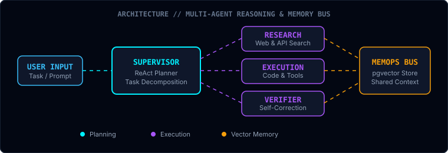
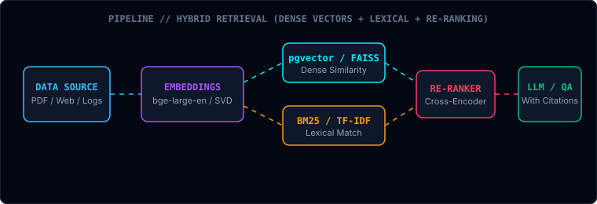
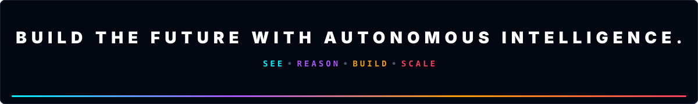

<div align="center">



<br/>

<a href="https://github.com/shannu018"></a>
&nbsp;
<a href="mailto:shannu018@gmail.com"></a>
&nbsp;
<a href="https://github.com/shannu018"></a>
&nbsp;
<a href="https://linkedin.com"></a>

<br/><br/>


</div>

<br/>


<br/>

<div align="center">

### I design autonomous AI systems, hybrid memory engines, and high-throughput software architectures.

From multi-agent swarm orchestration to production RAG memory backends and reactive web frontends — I engineer end-to-end systems where intelligence becomes reliable software.

</div>

<br/>

<div align="center">
  
</div>

<br/>


<br/>

<div align="center">

</div>

<br/>

<table width="100%">
<tr>
<td width="33%" align="center" valign="top">


### 🧠 AI &amp; REASONING

**Swarms · Memory · RAG**

Multi-Agent ReAct loops, hybrid vector retrieval with pgvector/Qdrant, tool orchestration, reinforcement learning, and LLM memory backends engineered for auditability and zero hallucination.

</td>
<td width="33%" align="center" valign="top">


### ⚙️ DISTRIBUTED SYSTEMS

**APIs · Async · Microservices**

FastAPI backends, PostgreSQL with vector indices, Docker orchestration, Redis pub/sub messaging, OpenTelemetry tracing, and resilient backend pipelines.

</td>
<td width="33%" align="center" valign="top">


### 🎨 FULL-STACK &amp; UI

**Next.js · WebSockets · Interactive**

Responsive web applications built with Next.js, React, Tailwind CSS, real-time WebSocket state management, and high-performance visual dashboards.

</td>
</tr>
</table>

<div align="center">

> **"First make it inspectable. Then make it resilient. Then make it fast."**

</div>

<br/>


<br/>

<div align="center">

</div>

<br/>

## `FEATURED SYSTEMS`

<br/>

### `01` / AUTONOMOUS AGENT ORCHESTRATION ENGINE

<table width="100%">
<tr>
<td width="55%" valign="top">

**A distributed ReAct-style multi-agent engine that coordinates specialized worker agents across dynamic tool ecosystems.**

The system features a centralized Supervisor Agent that decomposes user objectives into sub-tasks, assigns execution to specialized worker nodes, and manages state through a shared vector memory bus.

**Key Architectural Decisions:**
- ReAct planning loop with deterministic fallback routines
- Shared vector memory store for cross-agent context persistence
- Asynchronous parallel worker execution via FastAPI + Redis
- Full OpenTelemetry trace logs for every reasoning step

<br/>

`Python` `FastAPI` `ReAct Pattern` `Redis` `Docker` `OpenTelemetry`

<a href="https://github.com/shannu018"></a>

</td>
<td width="45%" valign="top">



</td>
</tr>
</table>

<br/>

---

<br/>

### `02` / HYBRID RETRIEVAL VECTOR RAG MEMORY ENGINE

<table width="100%">
<tr>
<td width="45%" valign="top">



</td>
<td width="55%" valign="top">

**Production-grade RAG backend combining dense vector similarity with lexical BM25 matching and cross-encoder re-ranking.**

Solves document knowledge decay and hallucination by binding verifiable citations and confidence scores to every synthesized answer.

**Hybrid Retrieval Signals:**
- **Dense Vectors:** Dense embeddings via SentenceTransformers / pgvector
- **Lexical Matching:** BM25 sparse keyword scoring
- **Re-ranking:** Cross-Encoder sentence re-scoring
- **Verification:** Source page chunk citations with decay tracking

<br/>

`Python` `PostgreSQL` `pgvector` `FAISS` `FastAPI` `SentenceTransformers`

<a href="https://github.com/shannu018"></a>

</td>
</tr>
</table>

<br/>


<br/>

<div align="center">

</div>

<br/>

## `SELECTED PROJECTS`

<table width="100%">
<tr>
<td width="50%" valign="top">

### 🔍 OFFLINE PDF RAG CHATBOT
**Local PDF Question-Answering Pipeline**

TF-IDF/FAISS vector indexing → sentence re-ranking → page citation engine. Runs 100% offline without external API keys.

`Python` `FAISS` `Streamlit` `PyPDF`

<a href="https://github.com/shannu018">→ view repository</a>

</td>
<td width="50%" valign="top">

### 🎮 TABULAR RL AGENT
**Reinforcement Learning Environment from Scratch**

GridWorld &amp; Tic-Tac-Toe Q-learning with epsilon-greedy exploration, sparse Q-tables, and visual convergence charts.

`Python` `NumPy` `Streamlit`

<a href="https://github.com/shannu018">→ view repository</a>

</td>
</tr>
<tr>
<td width="50%" valign="top">

### 📷 REAL-TIME COMPUTER VISION SUITE
**Visual Analytics &amp; Edge Processing**

YOLOv8 object tracking + Haar cascades + HSV color segmentation with real-time video stream support.

`Python` `OpenCV` `YOLOv8` `CUDA`

<a href="https://github.com/shannu018">→ view repository</a>

</td>
<td width="50%" valign="top">

### ⚡ NEXT.JS REAL-TIME DASHBOARD
**Reactive Control Center UI**

Modern dashboard with dark glassmorphism, WebSocket streaming state, and dynamic telemetry visualizers.

`TypeScript` `Next.js` `Tailwind` `WebSockets`

<a href="https://github.com/shannu018">→ view repository</a>

</td>
</tr>
</table>

<br/>


<br/>

<div align="center">

</div>

<br/>

## `TECHNOLOGY SYSTEMS`

<table width="100%">
<tr>
<td width="33%" align="center" valign="top">

### 🧠 INTELLIGENCE &amp; AI

<br/>


</td>
<td width="33%" align="center" valign="top">

### ⚙️ BACKEND &amp; SYSTEMS

<br/>


</td>
<td width="33%" align="center" valign="top">

### 🎨 FRONTEND &amp; UI

<br/>


</td>
</tr>
</table>

<br/>


<br/>

<div align="center">

</div>

<br/>

## `SYSTEM TELEMETRY`

<div align="center">


&nbsp;


<br/><br/>


<br/><br/>


<br/><br/>


</div>

<br/>


<br/>

<div align="center">

### 🐍 CONTRIBUTION GRAPH

<picture>
  <source media="(prefers-color-scheme: dark)" srcset="https://raw.githubusercontent.com/shannu018/shannu018/output/snake-dark.svg" />
  <source media="(prefers-color-scheme: light)" srcset="https://raw.githubusercontent.com/shannu018/shannu018/output/snake.svg" />
  
</picture>

</div>

<br/>


<br/>

<div align="center">

</div>

<br/>

## `CURRENT VECTOR`

<div align="center">

```
ACTIVE RESEARCH & DEVELOPMENT DIRECTIONS
├── 🧠 Multi-Agent Orchestration Swarms & Distributed Memory
├── ⚡ Resilient Vector RAG Memory Pipelines (pgvector + Qdrant)
├── ⚙️ High-Performance Microservices & OpenTelemetry Observability
└── 🎨 Real-time Control Center Frontends & Interactive Dashboards
```

</div>

<br/>


<br/>

<div align="center">

## LET'S BUILD SOMETHING EXTRAORDINARY.

<br/>

<a href="mailto:shannu018@gmail.com"></a>
&nbsp;
<a href="https://github.com/shannu018"></a>
&nbsp;
<a href="https://linkedin.com"></a>

<br/><br/>

</div>


